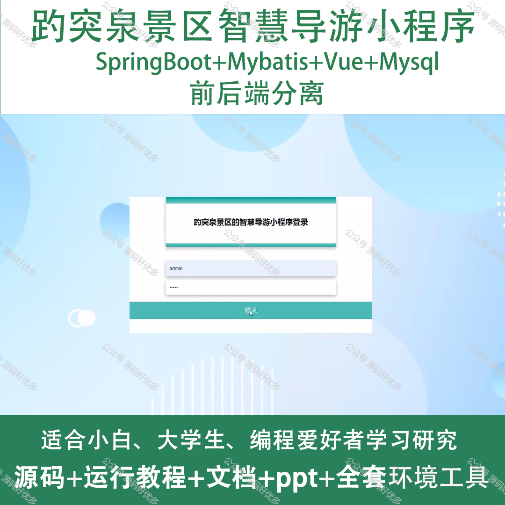
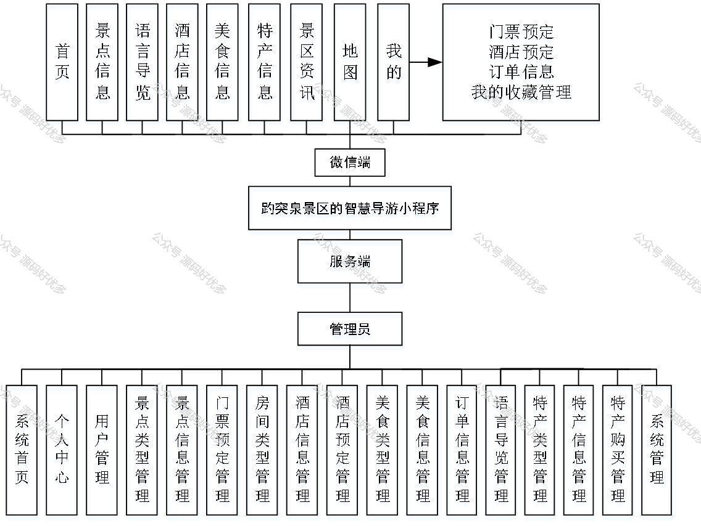
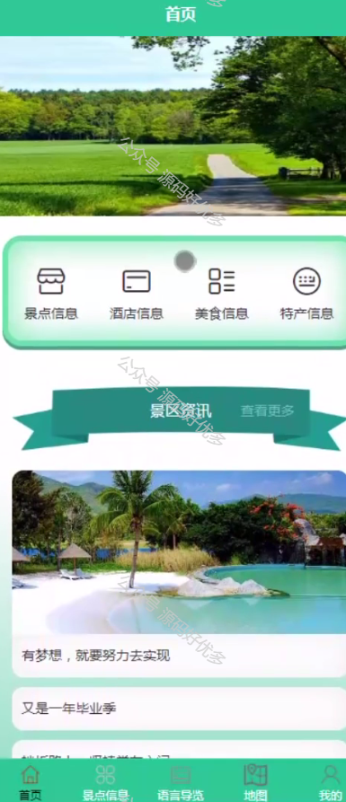
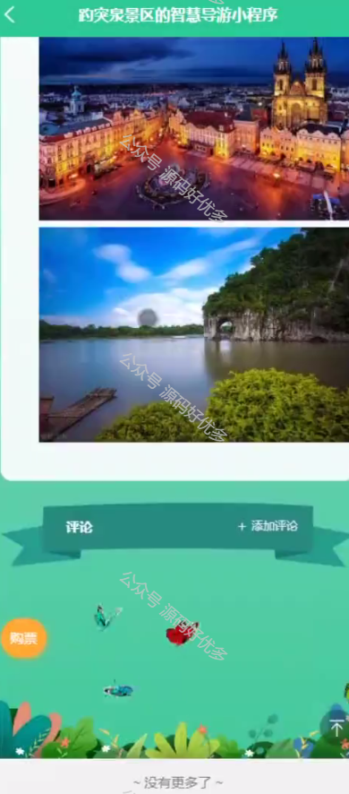
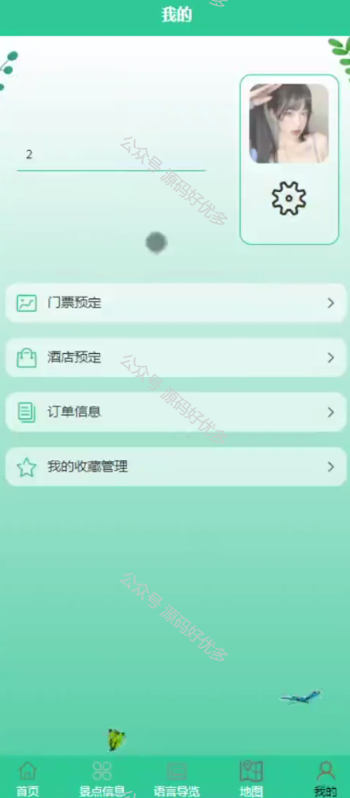
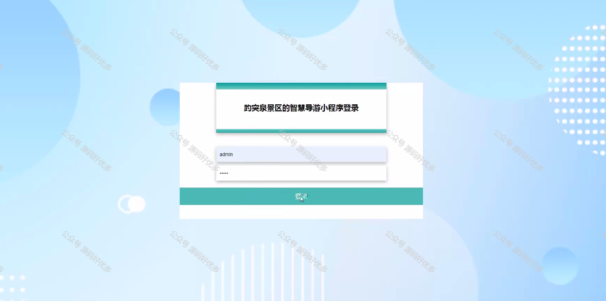
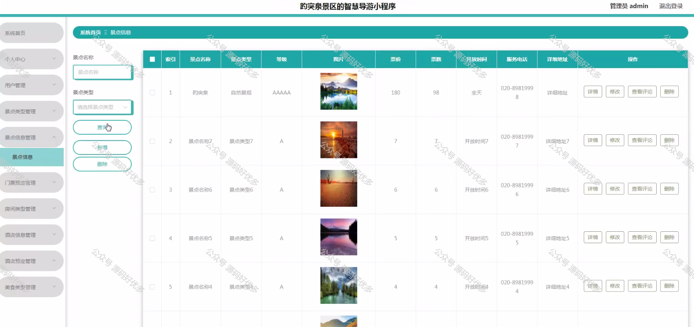
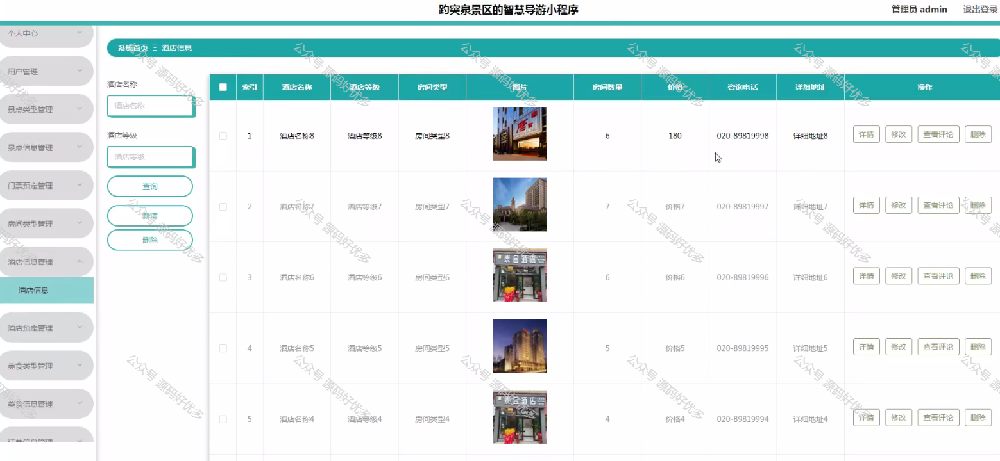
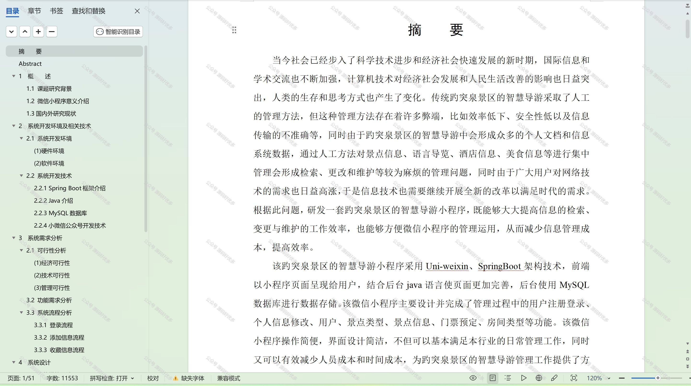

 
## 查看主页获取源码

> **作者介绍**： **✌**全网粉丝10W+本平台特邀作者、博客专家、CSDN新星计划导师、java领域优质创作者,博客之星、掘金/华为云/阿里云/InfoQ等平台优质作者、专注于项目实战 **✌**

  

### 一、作品包含

源码+数据库+设计文档万字+PPT+全套环境和工具资源+部署教程

### 二、项目技术

前端技术：Html、Css、Js、Vue、Element-ui

数据库：MySQL

后端技术：Java、Spring Boot、MyBatis

  

### 三、运行环境

开发工具：IDEA/eclipse + 微信开发者工具

数据库：MySQL5.7

数据库管理工具：Navicat10以上版本

环境配置软件： JDK1.8+Maven3.6.3

前端Nodejs：14

### 四、项目介绍
项目编号：mpweixinA014

"趵突泉景区智慧导游"微信小程序，是一款专为游客量身打造的智能导览工具。它以我国著名的趵突泉景区为背景，为游客提供一站式旅游服务体验。在这里，游客可以轻松规划游览路线，深入了解趵突泉的历史文化，享受科技带来的便捷旅游新方式。让每一位游客都能在趵突泉的美景中，感受到智慧旅游的魅力。

前台用户功能：首页、景点信息、语言导览、酒店信息、美食信息、特产信息、景区资讯、地图、门票预定、酒店预定、订单信息、我的收藏管理。

后台管理员的功能：个人中心、用户管理、景点类型管理、景点信息管理、门票预定管理、房间类型管理、酒店信息管理、酒店预定管理、美食类型管理、美食信息管理、订单信息管理、语言导览管理、特产类型管理、特产信息管理、特产购买管理、系统管理。

### 五、运行截图

  
